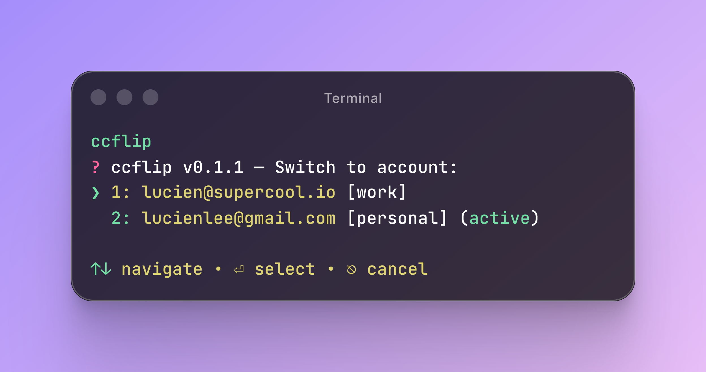

# caflip

A super lightweight multi-account switcher for coding agent CLIs.



caflip swaps authentication credentials between multiple accounts for:
- Claude Code
- Codex (`chatgpt-login` auth mode)

Use case: you have personal/work Claude or Codex accounts and want to switch quickly without re-login flows every time.


## Platform Support

| Platform | Credential Storage |
|---|---|
| macOS | System Keychain |
| Linux | `secret-tool` keyring (preferred), file-based fallback (owner-only access) |
| WSL | Same as Linux |
| Windows | Not yet supported |

## Install

### Binary (recommended)

```bash
curl -fsSL https://raw.githubusercontent.com/LucienLee/caflip/main/install.sh | bash
```

### Via npm (Node.js)

```bash
npm install -g caflip
```

### Via Bun

```bash
bun install -g caflip
```

### Local Development

```bash
bun run dev -- help
```

## Quick Start

```bash
# Add your first Claude account (must already be logged in)
caflip claude add --alias personal

# Add another Claude account
caflip claude add --alias work

# Pick provider interactively, then pick account
caflip

# Switch Claude by alias
caflip claude work
caflip claude personal

# Rotate Claude accounts
caflip claude next

# Use Codex provider explicitly
caflip codex add --alias codex-work
caflip codex list
caflip codex next
```

After switching, restart the target CLI (Claude Code or Codex) to pick up new authentication.

## Commands

| Command | Description |
|---|---|
| `caflip` | Interactive provider picker (Claude/Codex) |
| `caflip claude [command]` | Run command for Claude provider |
| `caflip codex [command]` | Run command for Codex provider |
| `caflip [provider]` | Interactive account picker for that provider |
| `caflip [provider] <alias>` | Switch by alias for that provider |
| `caflip [provider] list` | List managed accounts |
| `caflip [provider] add [--alias name]` | Add current account |
| `caflip [provider] remove [email]` | Remove an account |
| `caflip [provider] next` | Rotate to next account |
| `caflip [provider] status` | Show current account |
| `caflip [provider] alias <name> [email]` | Set alias for current or target account |
| `caflip help` | Show help |

### Alias Usage

```bash
# Set alias for current active account
caflip claude alias work

# Set alias for a specific managed account
caflip claude alias work hi.lucienlee@gmail.com

# Codex alias
caflip codex alias work me@company.com
```

`remove` target accepts email only. Omit it to choose from the interactive picker.

## Shell Prompt Integration

Show the current account in your prompt:

```bash
# .zshrc
PROMPT='$(caflip claude status) > '
PROMPT='$(caflip codex status) > '
```

Account data lives in:
- `~/.caflip-backup/claude/`
- `~/.caflip-backup/codex/`

## Credits

Inspired by [cc-account-switcher](https://github.com/ming86/cc-account-switcher).

## License

MIT
