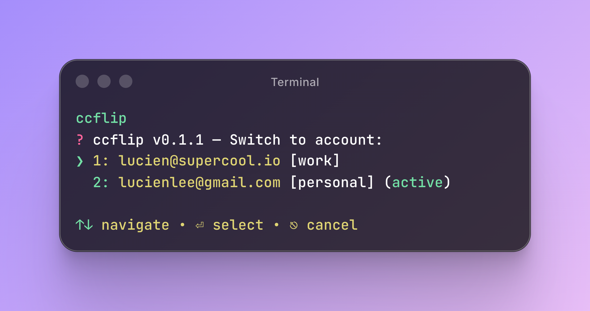

# caflip (Coding Agent Flipper)

A fast account switcher for coding agents like Claude Code and Codex.


Pick provider first, then switch account.

caflip is built for one job: if you have multiple Claude or Codex accounts, switch between them quickly.

Today, caflip supports both Claude Code and Codex accounts. Your skills, settings, themes, `CLAUDE.md`, MCP servers, keybindings, and all other configuration stay exactly the same while switching accounts.

Use case: you have personal/work Claude or Codex accounts and want to switch quickly without re-login flows every time.


## Platform Support

| Platform | Credential Storage |
|---|---|
| macOS | System Keychain |
| Linux | `CLAUDE_CONFIG_DIR/.credentials.json` when set, otherwise `~/.claude/.credentials.json`; `secret-tool` is kept as compatibility sync |
| WSL | Same as Linux |
| Windows | Not yet supported |

## Install

### Binary (recommended)

```bash
curl -fsSL https://raw.githubusercontent.com/LucienLee/caflip/main/install.sh | bash
```

To uninstall the standalone binary installed by this script:

```bash
curl -fsSL https://raw.githubusercontent.com/LucienLee/caflip/main/uninstall.sh | bash
```

### Via npm (Node.js)

```bash
npm install -g caflip
```

### Via Bun

```bash
bun install -g caflip
```

For package-manager installs, uninstall with the same package manager:

```bash
npm uninstall -g caflip
bun remove -g caflip
```

### Local Development

```bash
bun run dev -- help
```

## Quick Start

```bash
# Show current active account / all managed accounts across both providers
caflip status
caflip list

# Pick provider interactively, then add/remove/login
caflip add
caflip remove
caflip login

# Add your first Claude account (must already be logged in)
caflip claude add --alias personal

# Add another Claude account
caflip claude add --alias work

# Pick provider interactively, then pick account
caflip

# Switch Claude by alias
caflip claude work
caflip claude personal

# Rotate Claude accounts
caflip claude next

# Use Codex provider explicitly
caflip codex add --alias codex-work
caflip codex list
caflip codex next

# Run official provider login through caflip, then register the session
caflip claude login
caflip codex login

# Pass provider-specific flags after --
caflip claude login -- --email lucien@aibor.io --sso
caflip codex login -- --device-auth
```

After switching, restart the target CLI (Claude Code or Codex) to pick up new authentication.

## Commands

| Command | Description |
|---|---|
| `caflip` | Interactive provider picker (Claude/Codex) |
| `caflip list` | List managed accounts for Claude and Codex |
| `caflip status` | Show current active account for Claude and Codex |
| `caflip add [--alias name]` | Pick provider, then add current account |
| `caflip login [-- <args...>]` | Pick provider, then run provider login and register the resulting session |
| `caflip remove [email]` | Pick provider, then remove an account |
| `caflip claude [command]` | Run command for Claude provider |
| `caflip codex [command]` | Run command for Codex provider |
| `caflip [provider]` | Interactive account picker for that provider |
| `caflip [provider] <alias>` | Switch by alias for that provider |
| `caflip [provider] list` | List managed accounts |
| `caflip [provider] add [--alias name]` | Add current account |
| `caflip [provider] login [-- <args...>]` | Run provider login and register the resulting session |
| `caflip [provider] remove [email]` | Remove an account |
| `caflip [provider] next` | Rotate to next account |
| `caflip [provider] status` | Show current active account |
| `caflip [provider] alias <name> [account]` | Set alias for current or target account |
| `caflip help` | Show help |

### Alias Usage

```bash
# Set alias for current active account
caflip claude alias work

# Set alias by list number
caflip codex list
# 1: me@example.com · team(org-ab12Cd)
# 2: me@example.com · team(org-xy98Qw)
caflip codex alias aibor 2

# Reuse an existing alias as the target
caflip claude alias primary work

# Email works only when it matches exactly one managed account
caflip codex alias work me@company.com
```

`<account>` accepts:
- the account number shown in `caflip [provider] list`
- an existing alias
- an email, only when that email matches exactly one managed account

If the same email exists in multiple workspaces or organizations, use the list number or an existing alias instead.

Codex display labels use provider metadata conservatively:
- workspace plans such as `team` or `business` show `email · plan(orgShortId)`
- `free` shows `email · free`
- alias is the primary human-readable name when you need your own team label

`add`, `remove`, and `login` can be used without a provider prefix. In that case, caflip asks you to choose Claude or Codex first, then continues the normal command flow.

`remove` target accepts email only. Omit it to choose from the interactive picker after selecting a provider.

`login` can be used without arguments for the default login flow. Pass provider-specific flags after `--`:

```bash
caflip login
caflip claude login
caflip claude login -- --email lucien@aibor.io --sso
caflip codex login -- --device-auth
```

`status` shows the currently active account for the selected provider. It does not list every saved account.

Use `list` when you want to inspect all managed accounts for a provider.

## Shell Prompt Integration

Show the current account in your prompt:

```bash
# .zshrc
PROMPT='$(caflip claude status) > '
PROMPT='$(caflip codex status) > '
```

Account data lives in:
- `~/.caflip-backup/claude/`
- `~/.caflip-backup/codex/`

On Linux and WSL, caflip follows Claude's config root for active Claude credentials and config:
- if `CLAUDE_CONFIG_DIR` is set, caflip reads `"$CLAUDE_CONFIG_DIR/.credentials.json"` and `"$CLAUDE_CONFIG_DIR/.claude.json"`
- otherwise it falls back to `~/.claude/.credentials.json` and then Claude's standard config lookup

## Credits

Inspired by [cc-account-switcher](https://github.com/ming86/cc-account-switcher).

## License

MIT
